# Kitsu Anime By Scores (October 2018)

Jump To:
- [Results - Average Ratings](#average-ratings)
- [Results - Rating Frequencies](#rating-frequencies)
- [October 2017 Results](https://github.com/wopian/kitsu-anime-by-scores/tree/master/2017/README.md)

## Development

- `yarn install` - Install dependencies
- `node .` - Get fresh data (optional, requires an `accessToken` for NSFW anime)
- `node graph` - Generate images (requires a [Plot.ly](https://plot.ly) account)
- `node stats` - Show statistics

### `env.js`

```js
module.exports = {
  PLOTLY_USERNAME: '',
  PLOTLY_API_KEY: '', // https://plot.ly/settings/api
  KITSU_AUTH_TOKEN: ''
}
```

## Results

### Average Ratings

Uses the `averageRating` field from Kitsu's API, which is the
weighted mean of the `ratingFrequencies`. There are a considerable
amount of unrated shows with this method, as this field is only
populated when more than `100` users have rated the show.

|          |      All |   TV | Movies | ONAs | OVAs | Specials | Music |
| -------: | -------: | ---: | -----: | ---: | ---: | -------: | ----: |
|    Rated | **7802** | 2830 |   1143 |  375 | 2059 |     1177 |   218 |
|  Unrated | **7536** | 1667 |   1538 |  854 | 1542 |     1255 |   680 |
|  Average | **6.90** | 7.08 |   7.03 | 6.54 | 6.71 |     6.88 |  6.53 |
|   Median | **6.90** | 7.10 |   7.15 | 6.57 | 6.70 |     6.88 |  6.56 |
| Variance | **0.52** | 0.53 |   0.64 | 0.84 | 0.39 |     0.33 |  0.30 |
|    STDEV | **0.72** | 0.73 |   0.80 | 0.92 | 0.63 |     0.58 |  0.55 |
|      10% | **6.06** | 6.14 |   5.92 | 5.53 | 6.05 |     6.18 |  5.92 |
|      20% | **6.38** | 6.51 |   6.43 | 6.02 | 6.30 |     6.46 |  6.12 |
|      30% | **6.58** | 6.74 |   6.72 | 6.22 | 6.46 |     6.61 |  6.27 |
|      40% | **6.74** | 6.93 |   6.94 | 6.42 | 6.59 |     6.75 |  6.42 |
|      50% | **6.90** | 7.10 |   7.15 | 6.57 | 6.70 |     6.88 |  6.56 |
|      60% | **7.07** | 7.26 |   7.30 | 6.72 | 6.83 |     7.01 |  6.67 |
|      70% | **7.25** | 7.45 |   7.45 | 6.97 | 6.95 |     7.15 |  6.77 |
|      80% | **7.47** | 7.68 |   7.65 | 7.24 | 7.15 |     7.33 |  6.97 |
|      90% | **7.84** | 8.06 |   8.00 | 7.65 | 7.44 |     7.62 |  7.18 |

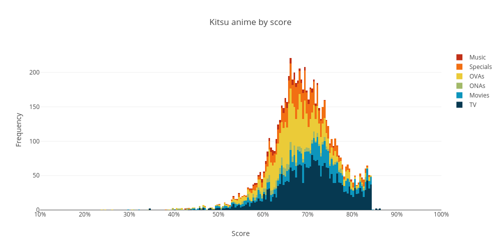
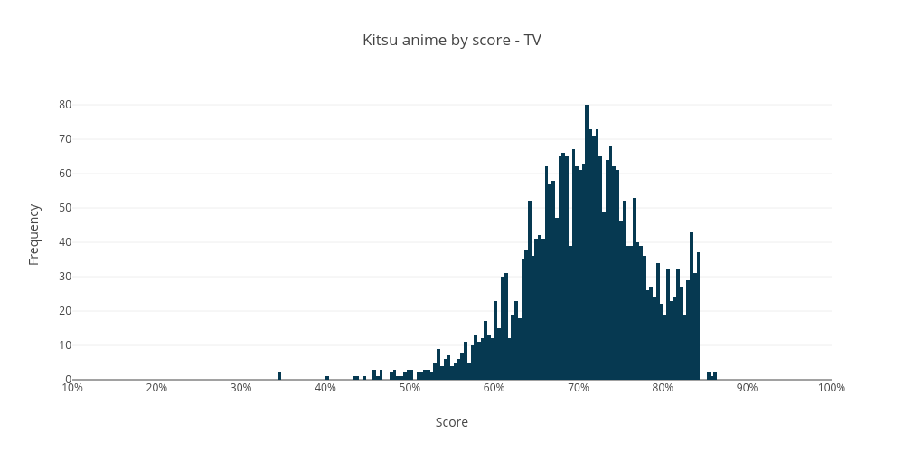
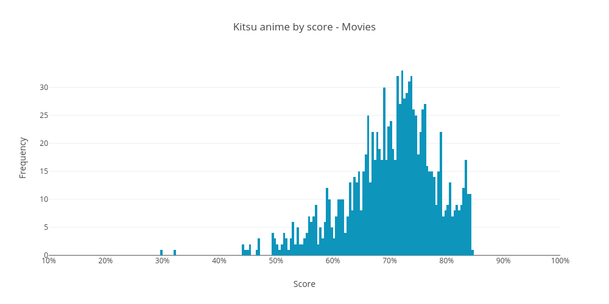
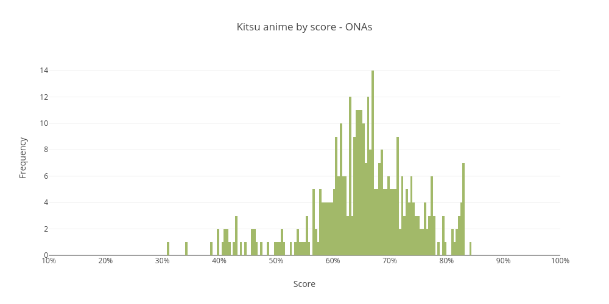
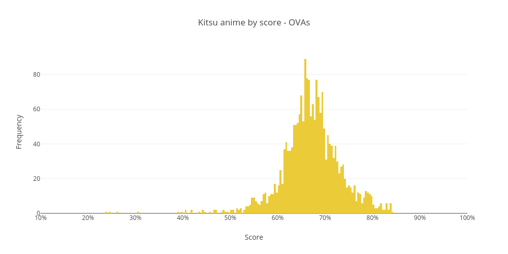
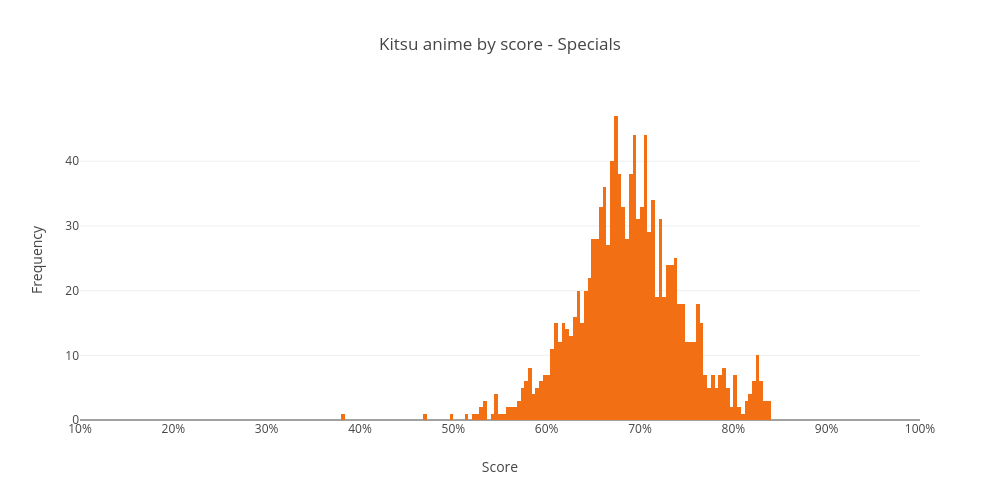
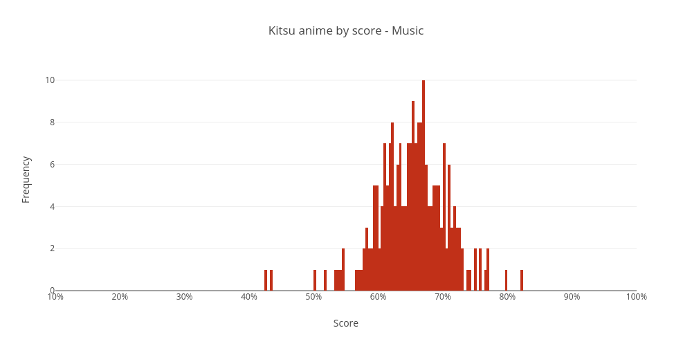

### Rating Frequencies

Essentially the raw rating for a show. `ratingFrequencies` is an
object that contains the number of users that have rated the show
on a `2..20` scale (`1` to `10` in `.5` increments). Converted into
a weighted mean to get an average rating.

All of these show clear spikes at `X.0` intervals (and somewhat less
prominent at `X.5` intervals), a result of many obscure shows which
only have a single user rating.

|          |       All |   TV | Movies | ONAs | OVAs | Specials | Music |
| -------: | --------: | ---: | -----: | ---: | ---: | -------: | ----: |
|    Rated | **14744** | 4381 |   2624 | 1159 | 3500 |     2216 |   864 |
|  Unrated |   **594** |  116 |     57 |   70 |  101 |      216 |    34 |
|  Average |  **5.72** | 6.26 |   5.75 | 5.18 | 5.60 |     5.50 |  4.73 |
|   Median |  **6.07** | 6.60 |   6.06 | 5.43 | 5.88 |     6.13 |  4.82 |
| Variance |  **3.46** | 2.97 |   3.43 | 3.82 | 2.64 |     4.72 |  2.32 |
|    STDEV |  **1.86** | 1.72 |   1.85 | 1.95 | 1.62 |     2.17 |  1.52 |
|      10% |  **3.50** | 4.33 |   3.34 | 3.00 | 3.82 |     2.00 |  3.00 |
|      20% |  **4.50** | 5.33 |   4.27 | 4.00 | 4.72 |     4.42 |  3.81 |
|      30% |  **5.15** | 5.93 |   4.96 | 4.50 | 5.14 |     5.21 |  4.10 |
|      40% |  **5.69** | 6.29 |   5.50 | 5.00 | 5.56 |     5.80 |  4.45 |
|      50% |  **6.07** | 6.60 |   6.06 | 5.43 | 5.88 |     6.13 |  4.82 |
|      60% |  **6.42** | 6.89 |   6.50 | 5.83 | 6.14 |     6.40 |  5.14 |
|      70% |  **6.77** | 7.17 |   6.95 | 6.26 | 6.45 |     6.70 |  5.50 |
|      80% |  **7.13** | 7.50 |   7.29 | 6.68 | 6.78 |     7.00 |  5.92 |
|      90% |  **7.63** | 7.98 |   7.80 | 7.34 | 7.25 |     7.42 |  6.50 |

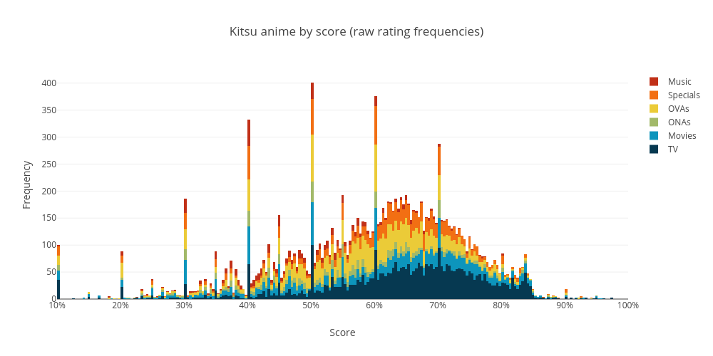
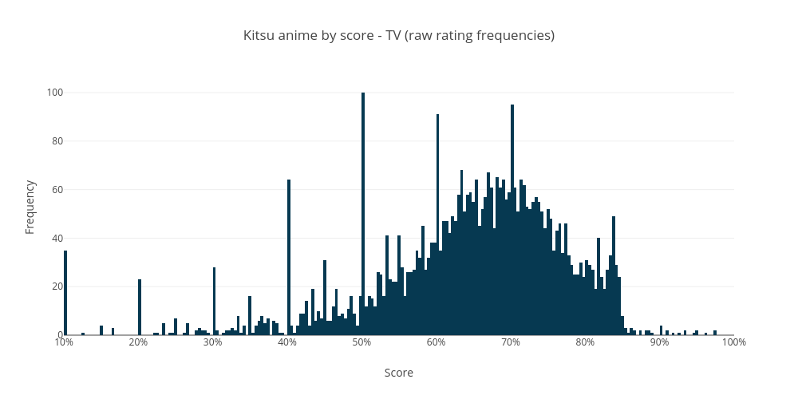
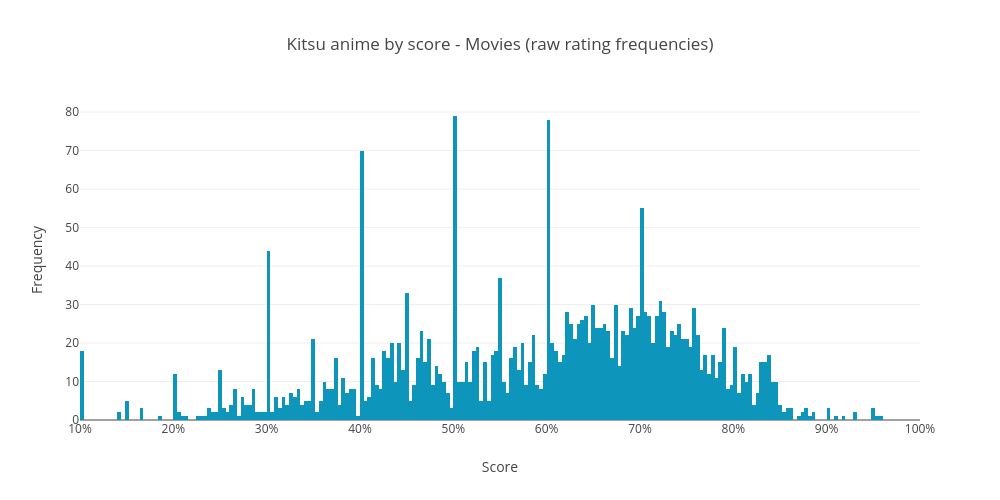
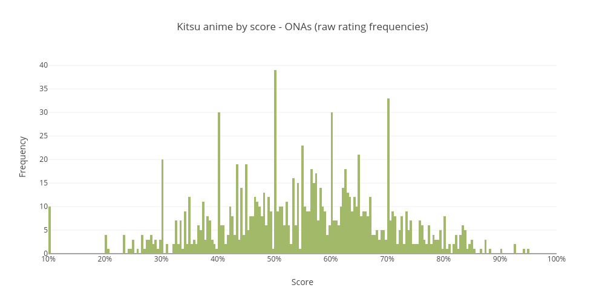
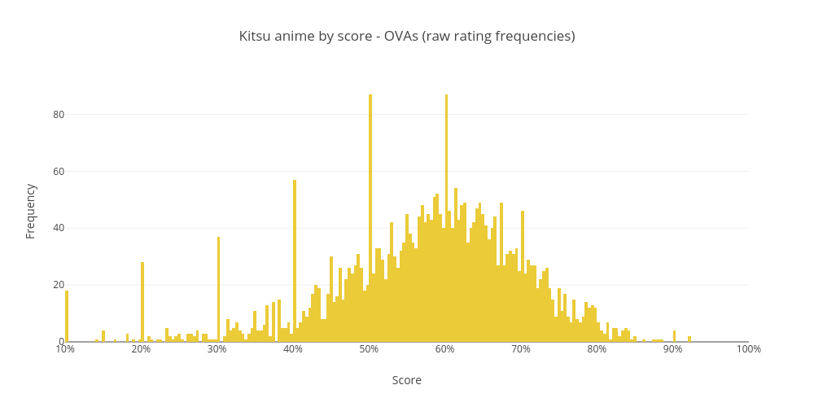
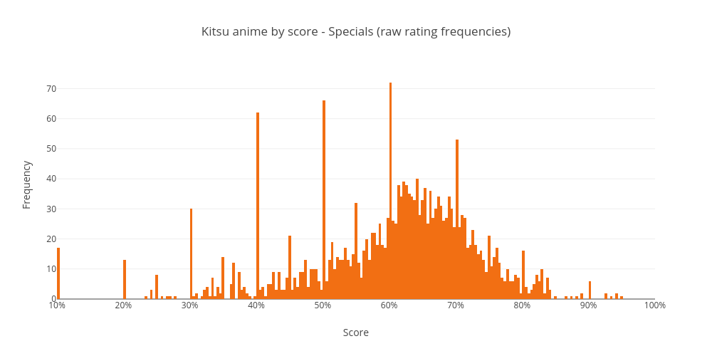
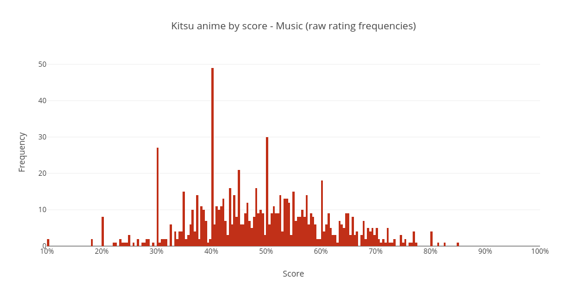
