# Kitsu Anime By Scores (February 2020)

Jump To:
- [Results - Average Ratings](#average-ratings)
- [Results - Rating Frequencies](#rating-frequencies)
- [October 2018 Results](https://github.com/wopian/kitsu-anime-by-scores/tree/master/2018/README.md)
- [October 2017 Results](https://github.com/wopian/kitsu-anime-by-scores/tree/master/2017/README.md)

## Development

- `yarn install` - Install dependencies
- `node .` - Get fresh data (optional, requires an `accessToken` for NSFW anime)
- `node graph` - Generate images (requires a [Plot.ly](https://plot.ly) account)
- `node stats` - Show statistics

### `env.js`

```js
module.exports = {
  PLOTLY_USERNAME: '',
  PLOTLY_API_KEY: '', // https://plot.ly/settings/api
  KITSU_AUTH_TOKEN: ''
}
```

## Results

### Average Ratings

Uses the `averageRating` field from Kitsu's API, which is the
weighted mean of the `ratingFrequencies`. There are a considerable
amount of unrated shows with this method, as this field is only
populated when more than `100` users have rated the show.

|          |      All |   TV | Movies | ONAs | OVAs | Specials | Music |
| -------: | -------: | ---: | -----: | ---: | ---: | -------: | ----: |
|    Rated | **9014** | 3173 |   1362 |  528 | 2313 |     1349 |   289 |
|  Unrated | **7280** | 1627 |   1428 |  941 | 1365 |     1139 |   780 |
|  Average | **6.86** | 7.04 |   6.98 | 6.62 | 6.65 |     6.85 |  6.50 |
|   Median | **6.86** | 7.08 |   7.11 | 6.64 | 6.63 |     6.83 |  6.52 |
| Variance | **0.52** | 0.52 |   0.64 | 0.81 | 0.40 |     0.33 |  0.31 |
|    STDEV | **0.72** | 0.72 |   0.80 | 0.90 | 0.63 |     0.58 |  0.55 |
|      10% | **6.01** | 6.12 |   5.91 | 5.69 | 5.99 |     6.15 |  5.86 |
|      20% | **6.33** | 6.49 |   6.40 | 6.05 | 6.22 |     6.41 |  6.09 |
|      30% | **6.53** | 6.71 |   6.67 | 6.28 | 6.39 |     6.57 |  6.25 |
|      40% | **6.69** | 6.90 |   6.90 | 6.47 | 6.51 |     6.71 |  6.39 |
|      50% | **6.86** | 7.08 |   7.11 | 6.64 | 6.63 |     6.83 |  6.52 |
|      60% | **7.04** | 7.24 |   7.25 | 6.83 | 6.76 |     6.98 |  6.62 |
|      70% | **7.23** | 7.41 |   7.43 | 7.09 | 6.92 |     7.12 |  6.72 |
|      80% | **7.45** | 7.65 |   7.62 | 7.37 | 7.13 |     7.32 |  6.92 |
|      90% | **7.80** | 8.02 |   7.95 | 7.74 | 7.43 |     7.59 |  7.16 |

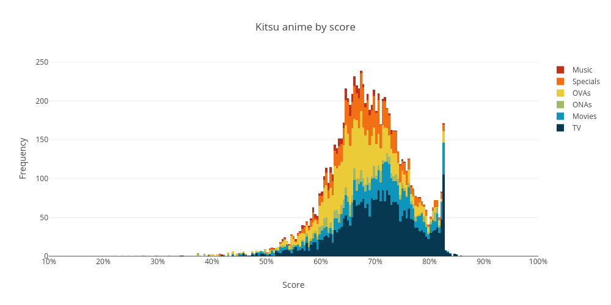
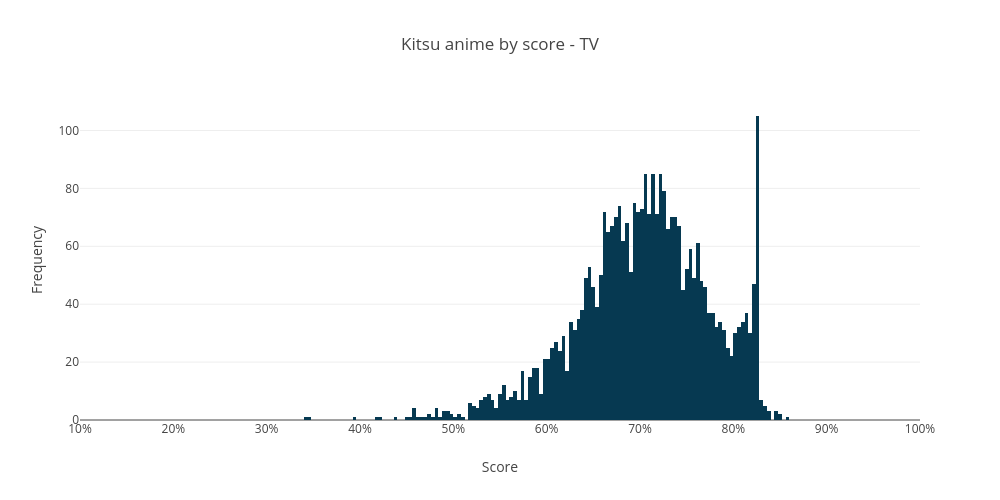
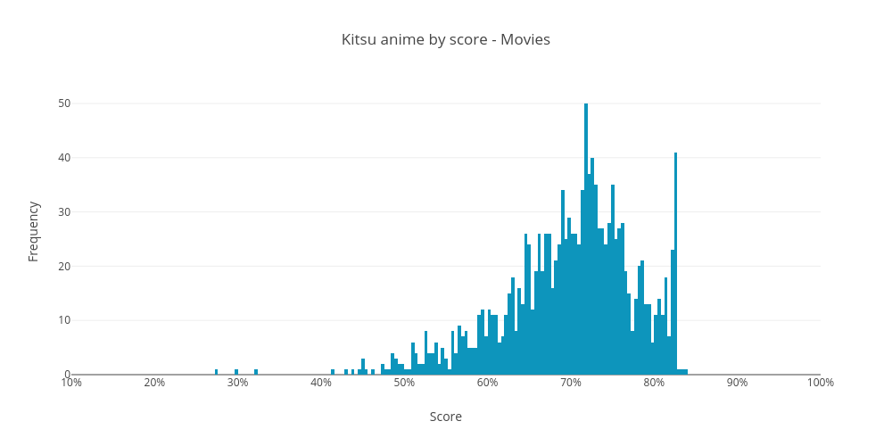
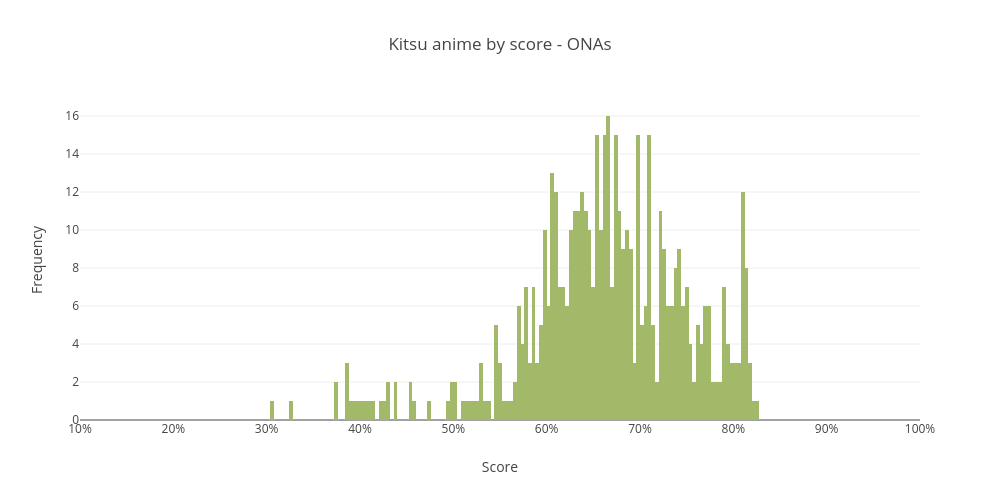
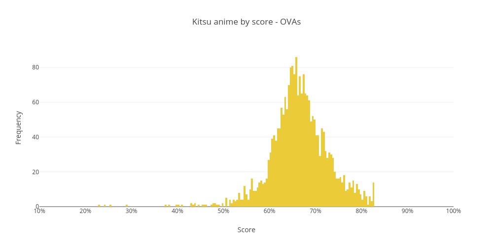
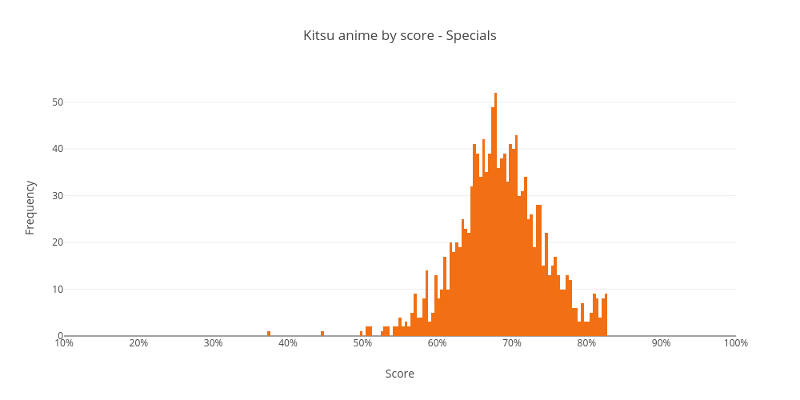
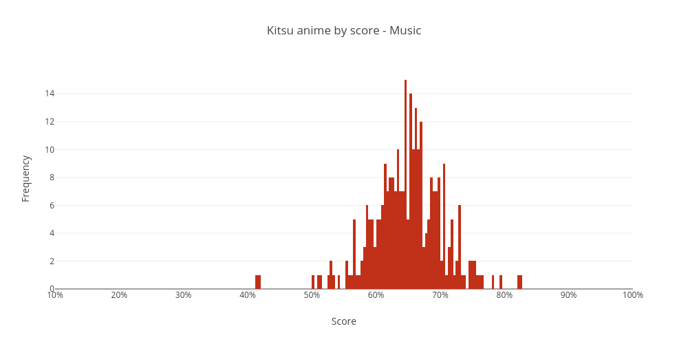

### Rating Frequencies

Essentially the raw rating for a show. `ratingFrequencies` is an
object that contains the number of users that have rated the show
on a `2..20` scale (`1` to `10` in `.5` increments). Converted into
a weighted mean to get an average rating.

All of these show clear spikes at `X.0` intervals (and somewhat less
prominent at `X.5` intervals), a result of many obscure shows which
only have a single user rating.

|          |       All |   TV | Movies | ONAs | OVAs | Specials | Music |
| -------: | --------: | ---: | -----: | ---: | ---: | -------: | ----: |
|    Rated | **16039** | 4697 |   2748 | 1423 | 3657 |     2456 |  1058 |
|  Unrated |   **255** |  103 |     42 |   46 |   21 |       32 |    11 |
|  Average |  **6.10** | 6.45 |   6.07 | 5.71 | 5.98 |     6.16 |  5.40 |
|   Median |  **6.23** | 6.64 |   6.26 | 5.83 | 6.03 |     6.27 |  5.40 |
| Variance |  **1.92** | 2.08 |   2.28 | 2.64 | 1.28 |     1.47 |  1.25 |
|    STDEV |  **1.39** | 1.44 |   1.51 | 1.63 | 1.13 |     1.21 |  1.12 |
|      10% |  **4.58** | 5.00 |   4.30 | 4.03 | 4.67 |     4.89 |  4.25 |
|      20% |  **5.17** | 5.68 |   4.92 | 4.71 | 5.14 |     5.40 |  4.64 |
|      30% |  **5.58** | 6.04 |   5.43 | 5.11 | 5.50 |     5.76 |  4.95 |
|      40% |  **5.95** | 6.38 |   5.89 | 5.50 | 5.79 |     6.03 |  5.21 |
|      50% |  **6.23** | 6.64 |   6.26 | 5.83 | 6.03 |     6.27 |  5.40 |
|      60% |  **6.51** | 6.92 |   6.63 | 6.14 | 6.30 |     6.50 |  5.62 |
|      70% |  **6.86** | 7.15 |   7.00 | 6.50 | 6.58 |     6.77 |  5.88 |
|      80% |  **7.13** | 7.47 |   7.29 | 7.00 | 7.00 |     7.00 |  6.25 |
|      90% |  **7.61** | 7.92 |   7.76 | 7.50 | 7.23 |     7.42 |  6.75 |

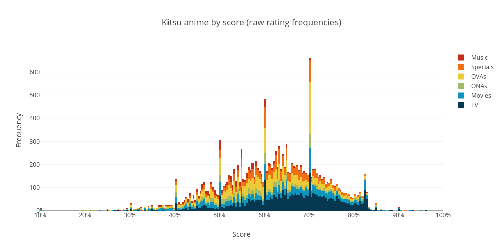
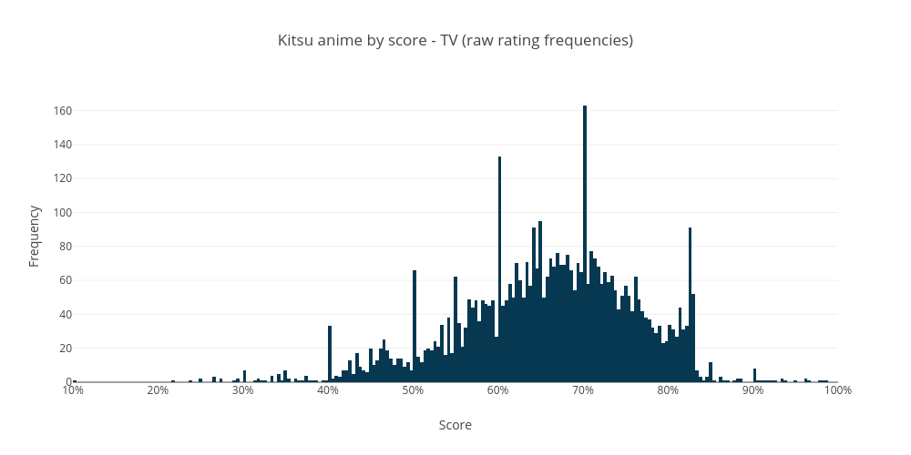
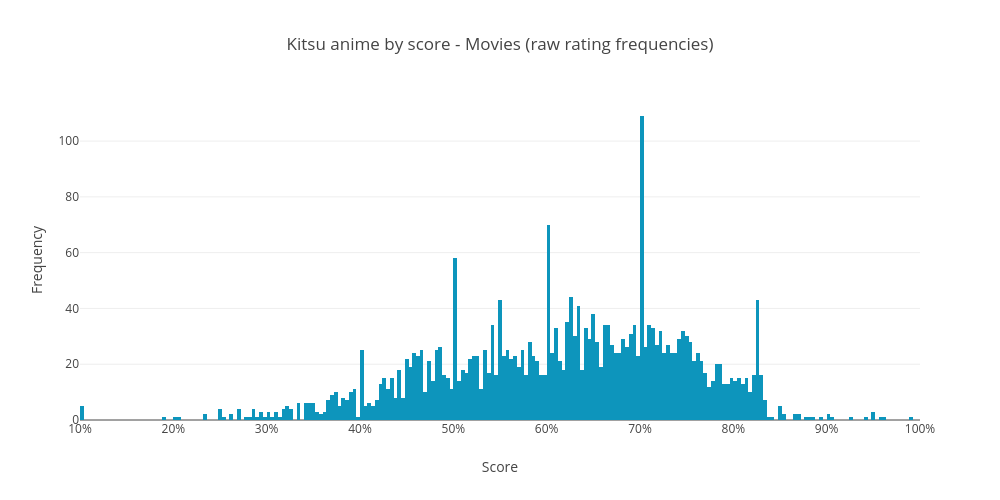
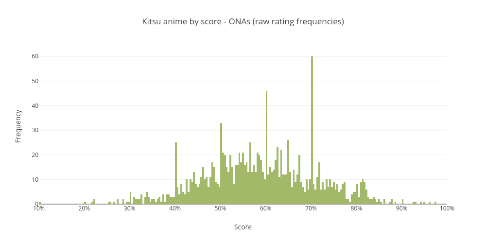
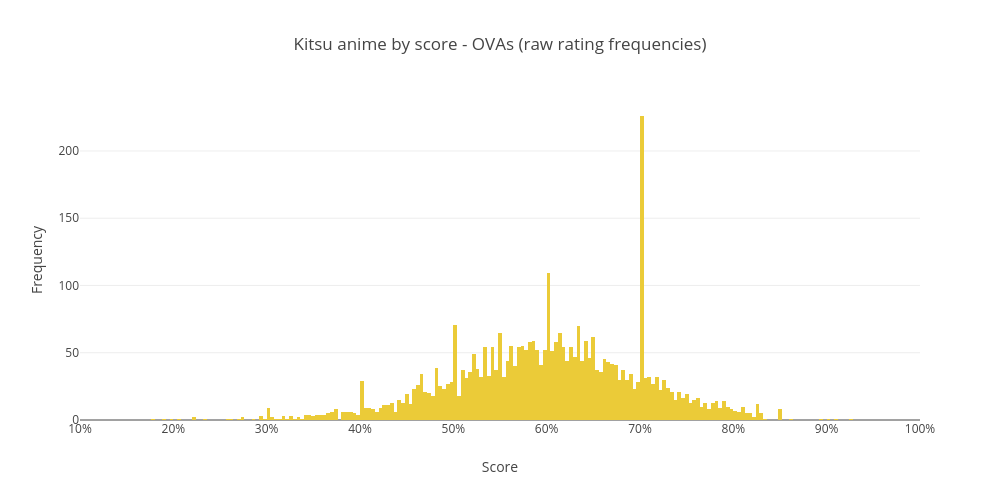
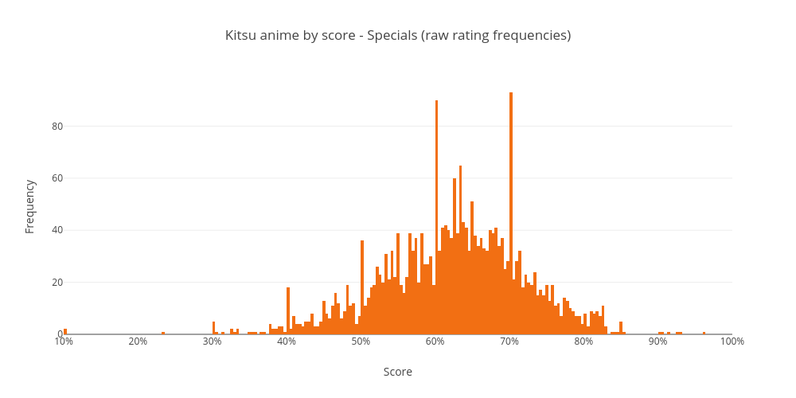
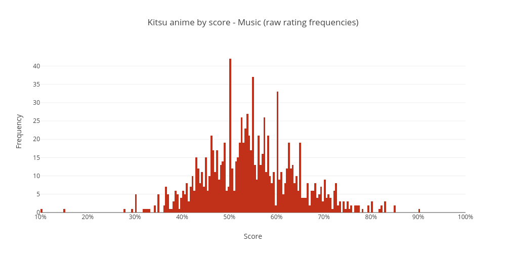
