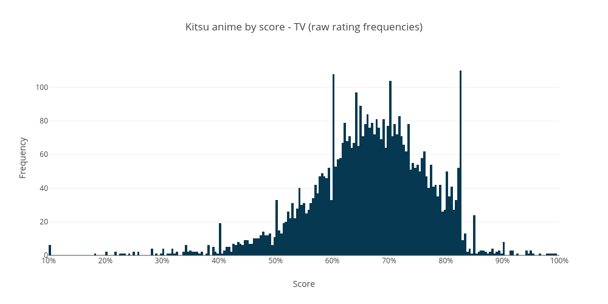

# Kitsu Anime By Scores (October 2020)

Jump To:
- [Results - Average Ratings](#average-ratings)
- [Results - Rating Frequencies](#rating-frequencies)
- [February 2020 Results](https://github.com/wopian/kitsu-anime-by-scores/tree/master/2020/February/README.md)
- [October 2018 Results](https://github.com/wopian/kitsu-anime-by-scores/tree/master/2018/README.md)
- [October 2017 Results](https://github.com/wopian/kitsu-anime-by-scores/tree/master/2017/README.md)

## Development

- `yarn install` - Install dependencies
- `node .` - Get fresh data (optional, requires an `accessToken` for NSFW anime)
- `node graph` - Generate images (requires a [Plot.ly](https://plot.ly) account)
- `node stats` - Show statistics

### `env.js`

```js
module.exports = {
  PLOTLY_USERNAME: '',
  PLOTLY_API_KEY: '', // https://plot.ly/settings/api
  KITSU_AUTH_TOKEN: ''
}
```

## Results

### Average Ratings

Uses the `averageRating` field from Kitsu's API, which is the
weighted mean of the `ratingFrequencies`. There are a considerable
amount of unrated shows with this method, as this field is only
populated when more than `100` users have rated the show.

|          |      All |   TV | Movies | ONAs | OVAs | Specials | Music |
| -------: | -------: | ---: | -----: | ---: | ---: | -------: | ----: |
|    Rated | **9730** | 3371 |   1491 |  624 | 2445 |     1447 |   352 |
|  Unrated | **7223** | 1577 |   1387 | 1018 | 1320 |     1098 |   823 |
|  Average | **6.84** | 7.03 |   6.95 | 6.64 | 6.62 |     6.83 |  6.49 |
|   Median | **6.83** | 7.06 |   7.04 | 6.64 | 6.60 |     6.80 |  6.49 |
| Variance | **0.52** | 0.52 |   0.63 | 0.78 | 0.41 |     0.33 |  0.31 |
|    STDEV | **0.72** | 0.72 |   0.79 | 0.88 | 0.64 |     0.57 |  0.55 |
|      10% | **6.00** | 6.11 |   5.90 | 5.72 | 5.94 |     6.14 |  5.84 |
|      20% | **6.30** | 6.47 |   6.34 | 6.06 | 6.18 |     6.40 |  6.12 |
|      30% | **6.50** | 6.70 |   6.63 | 6.30 | 6.35 |     6.54 |  6.25 |
|      40% | **6.67** | 6.88 |   6.85 | 6.48 | 6.48 |     6.69 |  6.38 |
|      50% | **6.83** | 7.06 |   7.04 | 6.64 | 6.60 |     6.80 |  6.49 |
|      60% | **7.02** | 7.23 |   7.21 | 6.85 | 6.74 |     6.95 |  6.59 |
|      70% | **7.21** | 7.41 |   7.40 | 7.09 | 6.89 |     7.09 |  6.73 |
|      80% | **7.44** | 7.64 |   7.61 | 7.38 | 7.11 |     7.28 |  6.89 |
|      90% | **7.79** | 8.01 |   7.92 | 7.78 | 7.42 |     7.57 |  7.19 |


### Rating Frequencies

Essentially the raw rating for a show. `ratingFrequencies` is an
object that contains the number of users that have rated the show
on a `2..20` scale (`1` to `10` in `.5` increments). Converted into
a weighted mean to get an average rating.

All of these show clear spikes at `X.0` intervals (and somewhat less
prominent at `X.5` intervals), a result of many obscure shows which
only have a single user rating.

|          |       All |   TV | Movies | ONAs | OVAs | Specials | Music |
| -------: | --------: | ---: | -----: | ---: | ---: | -------: | ----: |
|    Rated | **16737** | 4870 |   2834 | 1596 | 3750 |     2521 |  1166 |
|  Unrated |   **216** |   78 |     44 |   46 |   15 |       24 |     9 |
|  Average |  **6.20** | 6.58 |   6.14 | 5.84 | 6.08 |     6.26 |  5.55 |
|   Median |  **6.29** | 6.70 |   6.31 | 5.94 | 6.09 |     6.31 |  5.56 |
| Variance |  **1.84** | 1.89 |   2.25 | 2.51 | 1.39 |     1.35 |  1.02 |
|    STDEV |  **1.36** | 1.37 |   1.50 | 1.58 | 1.18 |     1.16 |  1.01 |
|      10% |  **4.75** | 5.25 |   4.34 | 4.36 | 4.75 |     5.08 |  4.46 |
|      20% |  **5.32** | 5.84 |   5.08 | 4.92 | 5.23 |     5.56 |  4.83 |
|      30% |  **5.71** | 6.18 |   5.57 | 5.33 | 5.58 |     5.85 |  5.11 |
|      40% |  **6.00** | 6.45 |   6.00 | 5.65 | 5.86 |     6.10 |  5.35 |
|      50% |  **6.29** | 6.70 |   6.31 | 5.94 | 6.09 |     6.31 |  5.56 |
|      60% |  **6.57** | 6.97 |   6.64 | 6.21 | 6.34 |     6.54 |  5.77 |
|      70% |  **6.88** | 7.21 |   7.00 | 6.55 | 6.62 |     6.79 |  6.00 |
|      80% |  **7.22** | 7.54 |   7.34 | 7.00 | 7.00 |     7.06 |  6.31 |
|      90% |  **7.74** | 8.00 |   7.82 | 7.64 | 7.49 |     7.50 |  6.75 |





