# Kitsu Anime By Scores (December 2021)

Jump To:
- [Results - Average Ratings](#average-ratings)
- [Results - Rating Frequencies](#rating-frequencies)
- [October 2020 Results](https://github.com/wopian/kitsu-anime-by-scores/tree/master/2020/October/README.md)
- [February 2020 Results](https://github.com/wopian/kitsu-anime-by-scores/tree/master/2020/February/README.md)
- [October 2018 Results](https://github.com/wopian/kitsu-anime-by-scores/tree/master/2018/README.md)
- [October 2017 Results](https://github.com/wopian/kitsu-anime-by-scores/tree/master/2017/README.md)

## Development

- `yarn install` - Install dependencies
- `node .` - Get fresh data (optional, requires an `accessToken` for NSFW anime)
- `node graph` - Generate images (requires a [Plot.ly](https://plot.ly) account)
- `node stats` - Show statistics

### `env.js`

```js
module.exports = {
  PLOTLY_USERNAME: '',
  PLOTLY_API_KEY: '', // https://plot.ly/settings/api
  KITSU_AUTH_TOKEN: ''
}
```

## Results

### Anime

#### Average Ratings

Uses the `averageRating` field from Kitsu's API, which is the
weighted mean of the `ratingFrequencies`. There are a considerable
amount of unrated shows with this method, as this field is only
populated when more than `100` users have rated the show.

|          |       All |   TV | Movies | ONAs | OVAs | Specials | Music |
| -------: | --------: | ---: | -----: | ---: | ---: | -------: | ----: |
|    Rated | **10843** | 3678 |   1676 |  805 | 2656 |     1595 |   433 |
|  Unrated |  **7803** | 1624 |   1521 | 1277 | 1191 |     1052 |  1138 |
|  Average |  **6.81** | 7.01 |   6.91 | 6.67 | 6.59 |     6.79 |  6.49 |
|   Median |  **6.81** | 7.04 |   7.01 | 6.67 | 6.57 |     6.77 |  6.48 |
| Variance |  **0.53** | 0.53 |   0.66 | 0.74 | 0.41 |     0.33 |  0.32 |
|    STDEV |  **0.73** | 0.73 |   0.81 | 0.86 | 0.64 |     0.58 |  0.57 |
|      10% |  **5.95** | 6.09 |   5.84 | 5.74 | 5.86 |     6.09 |  5.86 |
|      20% |  **6.26** | 6.44 |   6.28 | 6.08 | 6.14 |     6.37 |  6.11 |
|      30% |  **6.47** | 6.67 |   6.56 | 6.31 | 6.30 |     6.51 |  6.22 |
|      40% |  **6.64** | 6.86 |   6.79 | 6.51 | 6.44 |     6.64 |  6.35 |
|      50% |  **6.81** | 7.04 |   7.01 | 6.67 | 6.57 |     6.77 |  6.48 |
|      60% |  **6.99** | 7.22 |   7.19 | 6.87 | 6.72 |     6.91 |  6.60 |
|      70% |  **7.19** | 7.40 |   7.39 | 7.14 | 6.88 |     7.05 |  6.76 |
|      80% |  **7.42** | 7.62 |   7.59 | 7.45 | 7.09 |     7.23 |  6.92 |
|      90% |  **7.75** | 7.99 |   7.88 | 7.75 | 7.37 |     7.54 |  7.26 |

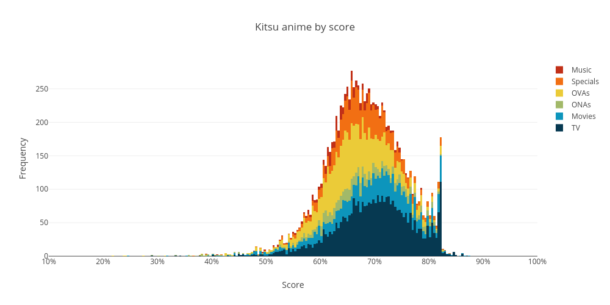
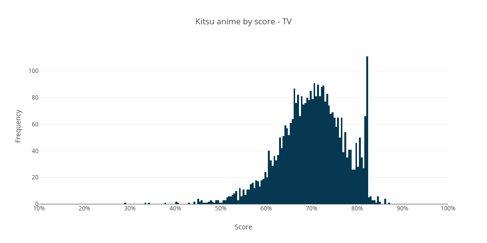
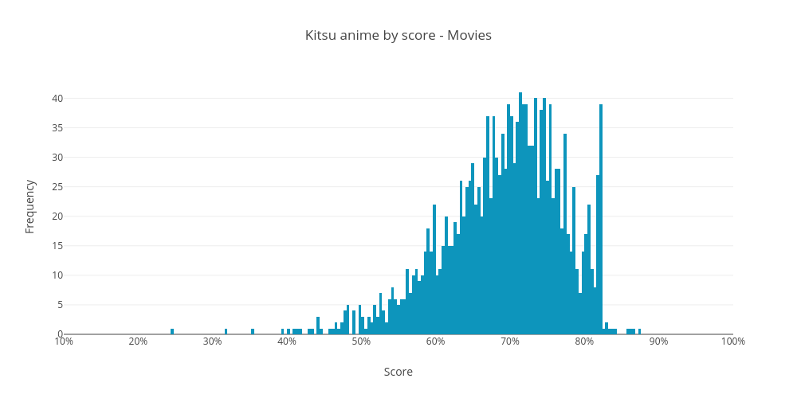
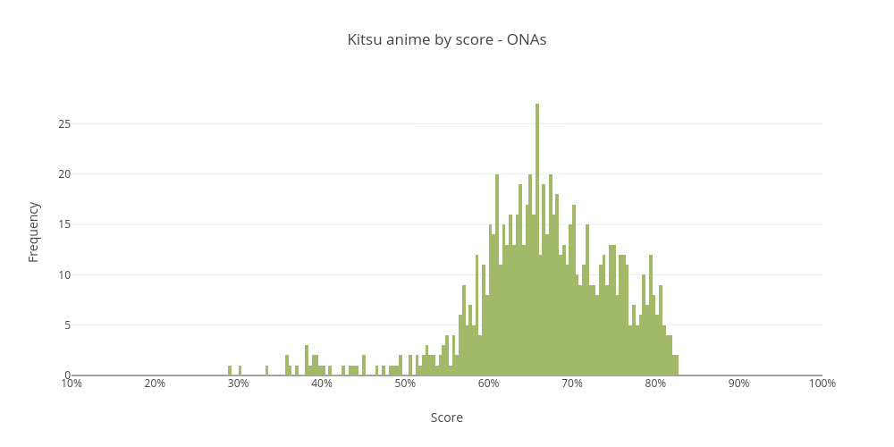
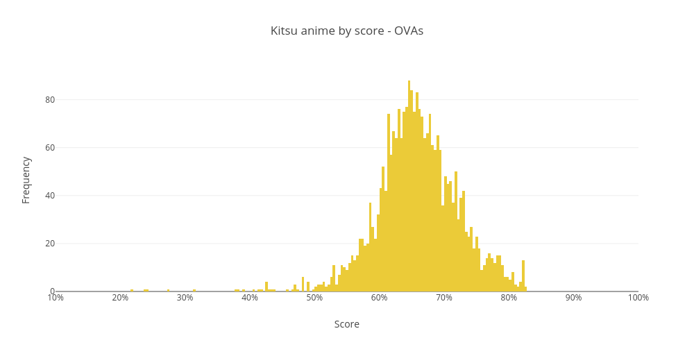

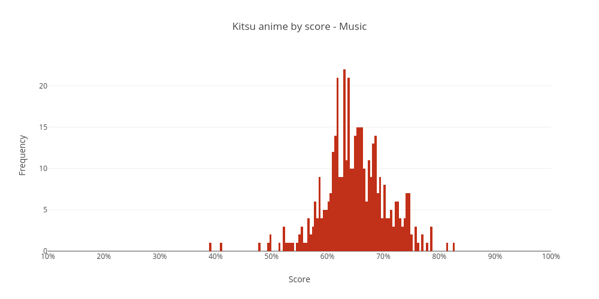

#### Rating Frequencies

Essentially the raw rating for a show. `ratingFrequencies` is an
object that contains the number of users that have rated the show
on a `2..20` scale (`1` to `10` in `.5` increments). Converted into
a weighted mean to get an average rating.

All of these show clear spikes at `X.0` intervals (and somewhat less
prominent at `X.5` intervals), a result of many obscure shows which
only have a single user rating.

|          |       All |   TV | Movies | ONAs | OVAs | Specials | Music |
| -------: | --------: | ---: | -----: | ---: | ---: | -------: | ----: |
|    Rated | **18413** | 5197 |   3152 | 2018 | 3839 |     2636 |  1571 |
|  Unrated |   **233** |  105 |     45 |   64 |    8 |       11 |     0 |
|  Average |  **6.15** | 6.46 |   6.10 | 5.85 | 6.06 |     6.21 |  5.75 |
|   Median |  **6.23** | 6.60 |   6.23 | 5.94 | 6.08 |     6.25 |  5.69 |
| Variance |  **1.74** | 2.10 |   2.07 | 2.42 | 1.20 |     1.06 |  0.81 |
|    STDEV |  **1.32** | 1.45 |   1.44 | 1.56 | 1.09 |     1.03 |  0.90 |
|      10% |  **4.79** | 5.07 |   4.46 | 4.46 | 4.79 |     5.02 |  4.69 |
|      20% |  **5.27** | 5.66 |   5.05 | 5.00 | 5.25 |     5.50 |  5.01 |
|      30% |  **5.64** | 6.04 |   5.50 | 5.35 | 5.58 |     5.79 |  5.25 |
|      40% |  **5.96** | 6.34 |   5.91 | 5.65 | 5.84 |     6.03 |  5.46 |
|      50% |  **6.23** | 6.60 |   6.23 | 5.94 | 6.08 |     6.25 |  5.69 |
|      60% |  **6.50** | 6.89 |   6.55 | 6.25 | 6.32 |     6.47 |  5.94 |
|      70% |  **6.81** | 7.17 |   6.93 | 6.60 | 6.58 |     6.70 |  6.19 |
|      80% |  **7.17** | 7.50 |   7.30 | 7.02 | 6.93 |     6.99 |  6.50 |
|      90% |  **7.66** | 7.97 |   7.74 | 7.55 | 7.38 |     7.45 |  6.95 |

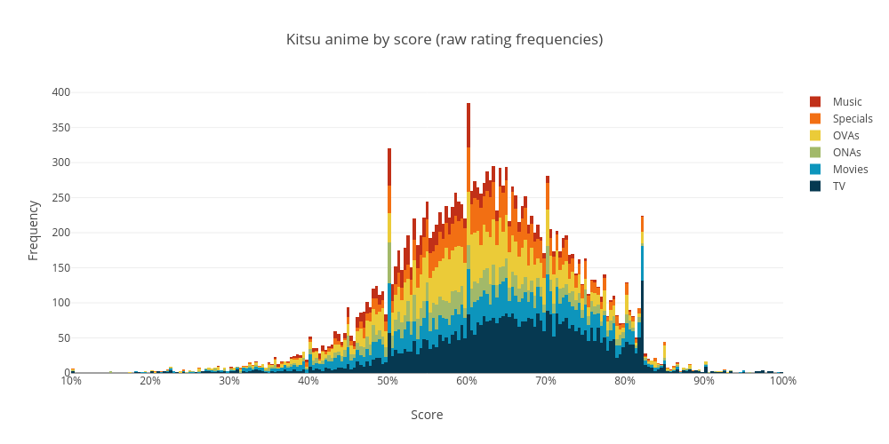
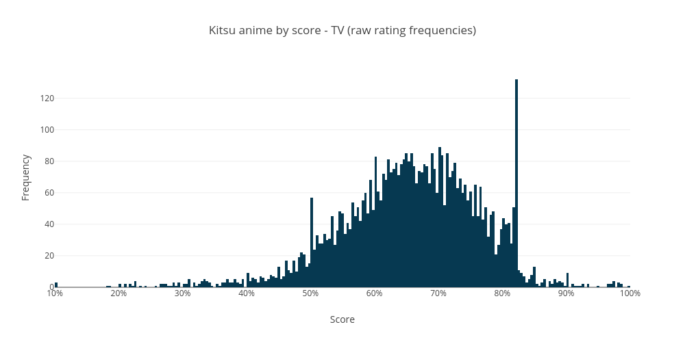
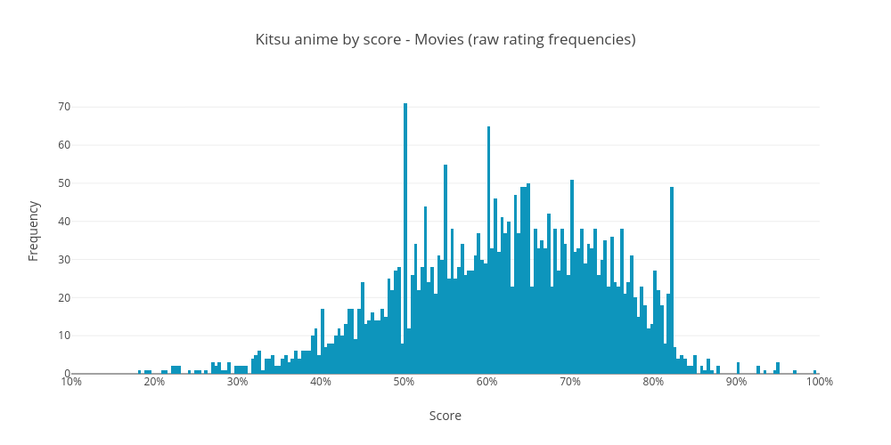
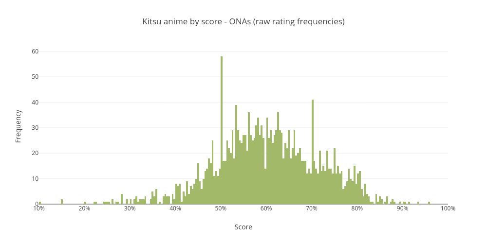
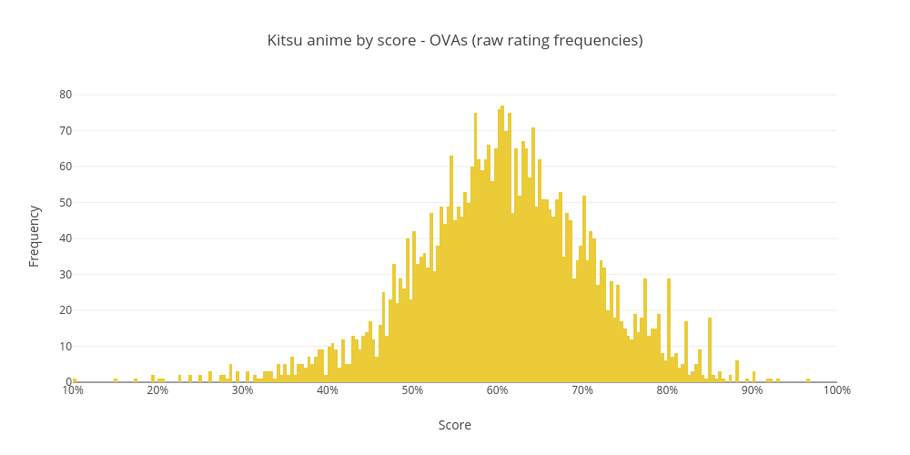
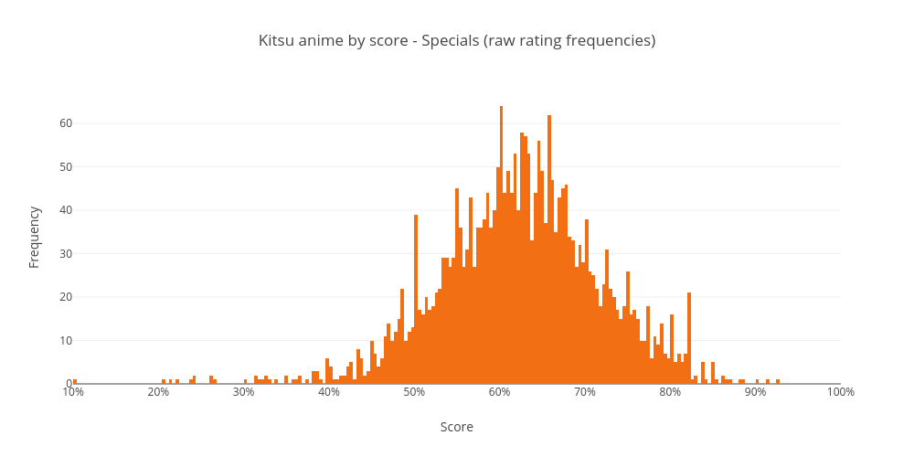
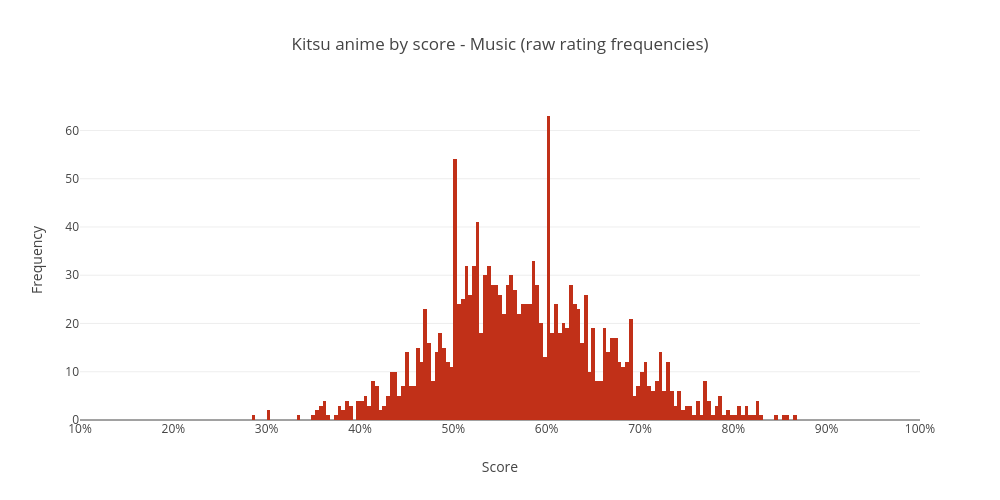

## Manga

### Average Ratings

|          |       All | Manga | Manhua | Manhwa | Novels | OELs | Doujins | Oneshots |
| -------: | --------: | ----: | -----: | -----: | -----: | ---: | ------: | -------: |
|    Rated |  **8905** |  7040 |    172 |    481 |    297 |   37 |     128 |      750 |
|  Unrated | **51107** | 25570 |   1221 |   1486 |  16574 |  478 |    1401 |     4377 |
|  Average |  **7.33** |  7.31 |   7.48 |   7.81 |   7.76 | 7.99 |    7.01 |     6.96 |
|   Median |  **7.34** |  7.33 |   7.48 |   7.86 |   7.82 | 8.08 |    7.17 |     7.01 |
| Variance |  **0.27** |  0.25 |   0.20 |   0.12 |   0.16 | 0.08 |    0.46 |     0.25 |
|    STDEV |  **0.52** |  0.50 |   0.45 |   0.35 |   0.40 | 0.29 |    0.68 |     0.50 |
|      10% |  **6.70** |  6.71 |   6.97 |   7.35 |   7.22 | 7.71 |    5.89 |     6.38 |
|      20% |  **6.96** |  6.97 |   7.11 |   7.56 |   7.46 | 7.84 |    6.61 |     6.65 |
|      30% |  **7.11** |  7.12 |   7.19 |   7.70 |   7.62 | 7.92 |    6.92 |     6.79 |
|      40% |  **7.22** |  7.22 |   7.37 |   7.78 |   7.73 | 8.02 |    7.08 |     6.91 |
|      50% |  **7.34** |  7.33 |   7.48 |   7.86 |   7.82 | 8.08 |    7.17 |     7.01 |
|      60% |  **7.45** |  7.43 |   7.63 |   7.96 |   7.90 | 8.12 |    7.23 |     7.10 |
|      70% |  **7.59** |  7.55 |   7.70 |   8.05 |   8.00 | 8.18 |    7.42 |     7.19 |
|      80% |  **7.76** |  7.70 |   7.91 |   8.13 |   8.15 | 8.20 |    7.54 |     7.30 |
|      90% |  **8.00** |  7.93 |   8.09 |   8.21 |   8.24 | 8.23 |    7.68 |     7.48 |

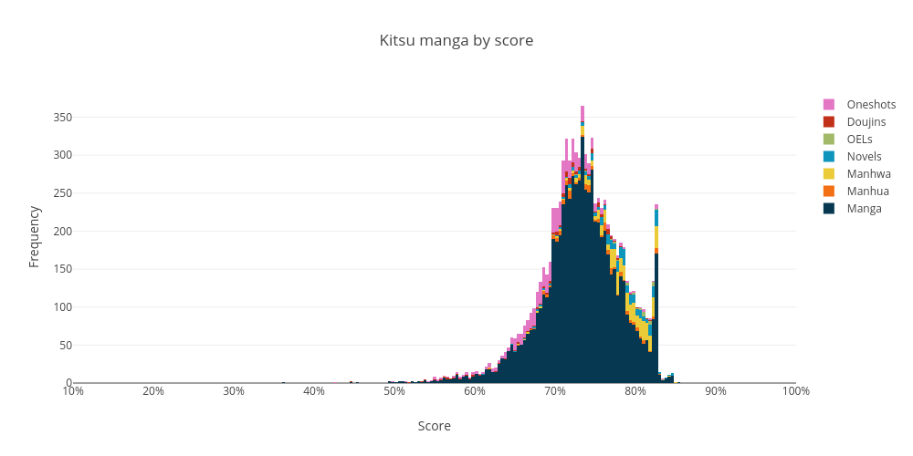
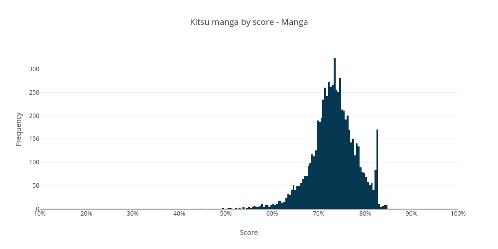
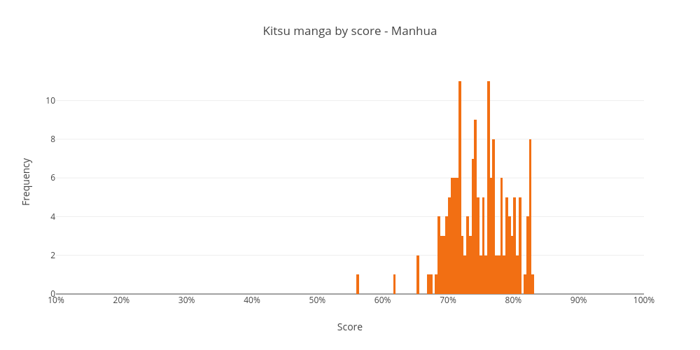
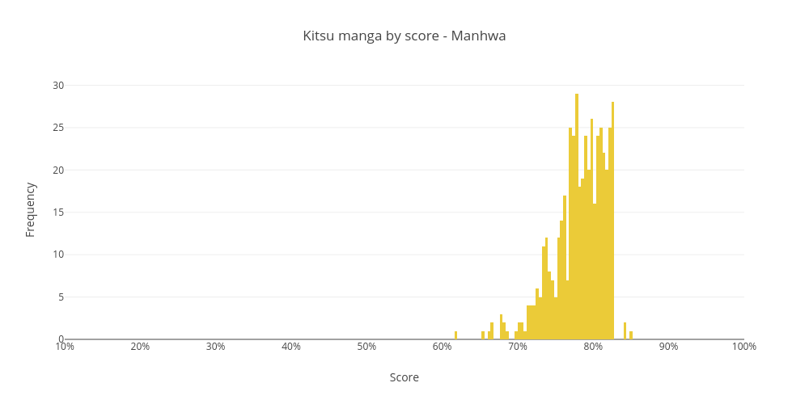
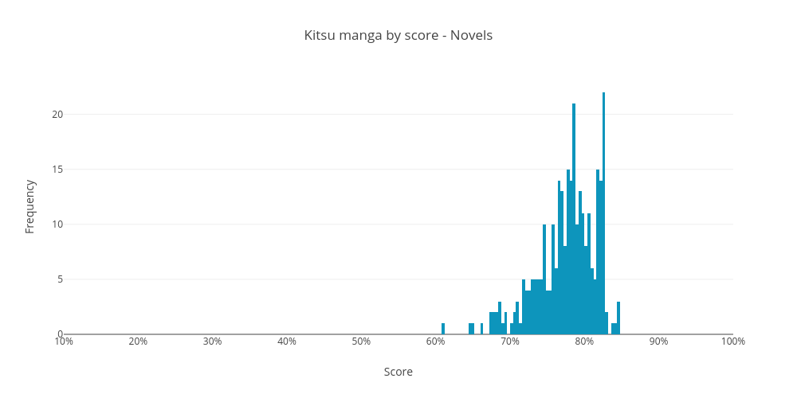
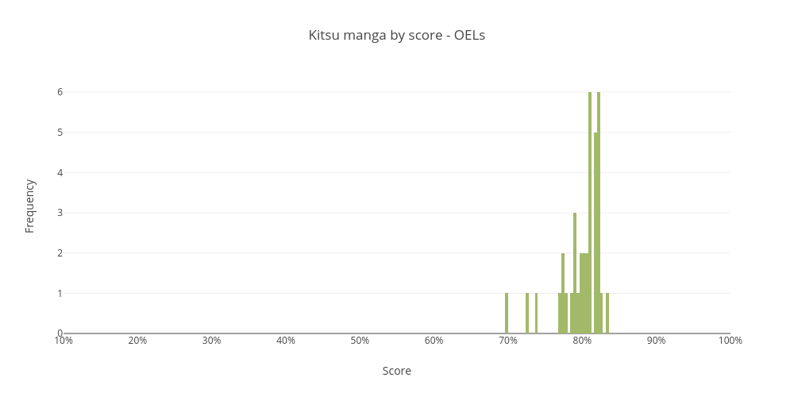
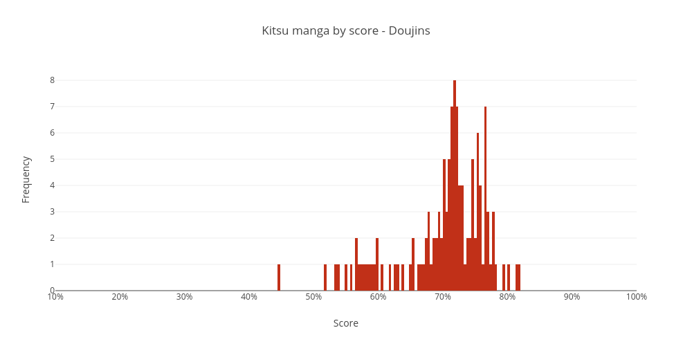
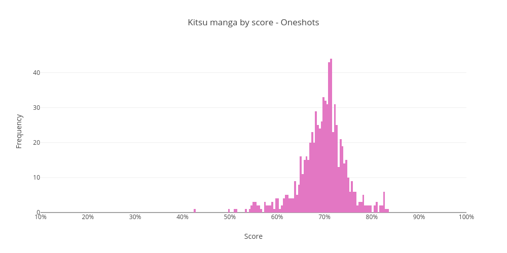

### Rating Frequencies

|          |       All | Manga | Manhua | Manhwa | Novels | OELs | Doujins | Oneshots |
| -------: | --------: | ----: | -----: | -----: | -----: | ---: | ------: | -------: |
|    Rated | **57539** | 32153 |   1282 |   1911 |  15139 |  433 |    1508 |     5113 |
|  Unrated |  **2473** |   457 |    111 |     56 |   1732 |   82 |      21 |       14 |
|  Average |  **6.14** |  6.49 |   6.29 |   7.02 |   5.41 | 5.94 |    6.15 |     6.04 |
|   Median |  **6.47** |  6.69 |   6.83 |   7.46 |   5.00 | 7.00 |    6.32 |     6.15 |
| Variance |  **3.39** |  2.07 |   5.00 |   2.78 |   5.57 | 8.39 |    2.18 |     1.24 |
|    STDEV |  **1.84** |  1.44 |   2.24 |   1.67 |   2.36 | 2.90 |    1.48 |     1.11 |
|      10% |  **5.00** |  5.00 |   3.75 |   5.00 |   0.00 | 0.00 |    4.80 |     5.00 |
|      20% |  **5.00** |  5.20 |   5.50 |   6.25 |   5.00 | 5.00 |    5.00 |     5.00 |
|      30% |  **5.00** |  6.00 |   6.15 |   6.83 |   5.00 | 5.00 |    5.29 |     5.33 |
|      40% |  **6.00** |  6.43 |   6.53 |   7.15 |   5.00 | 6.50 |    5.94 |     5.84 |
|      50% |  **6.47** |  6.69 |   6.83 |   7.46 |   5.00 | 7.00 |    6.32 |     6.15 |
|      60% |  **6.79** |  6.97 |   7.06 |   7.69 |   5.29 | 7.40 |    6.65 |     6.38 |
|      70% |  **7.10** |  7.20 |   7.36 |   7.92 |   6.61 | 7.87 |    6.92 |     6.66 |
|      80% |  **7.50** |  7.52 |   7.74 |   8.12 |   7.40 | 8.19 |    7.34 |     6.91 |
|      90% |  **8.06** |  8.00 |   8.25 |   8.33 |   8.45 | 8.50 |    7.83 |     7.34 |

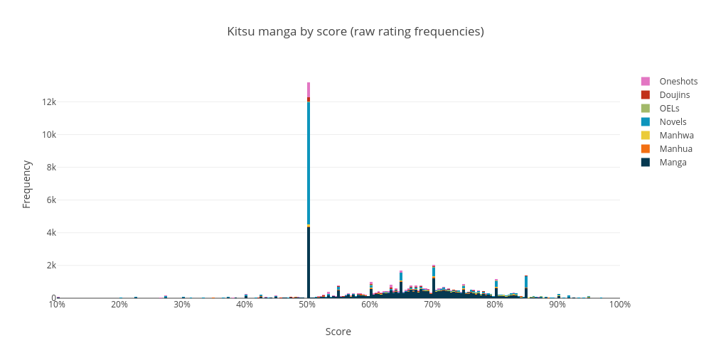
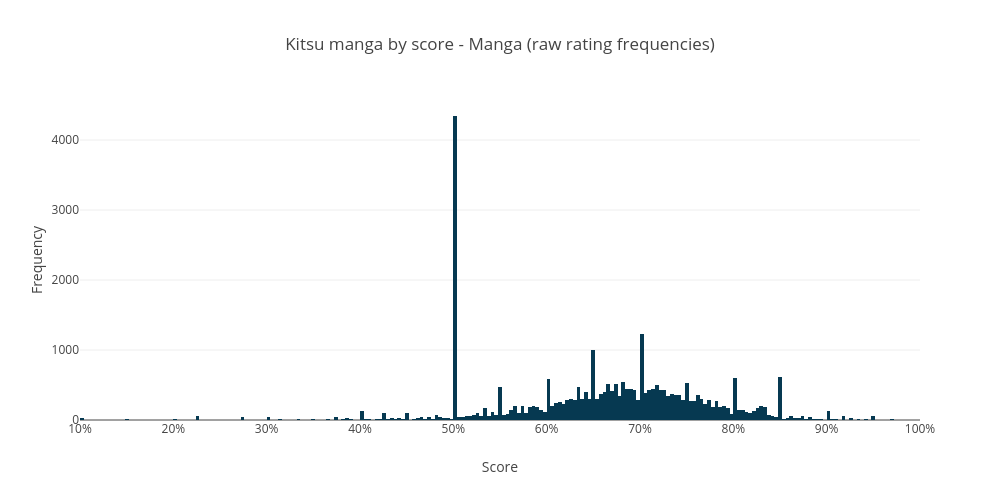
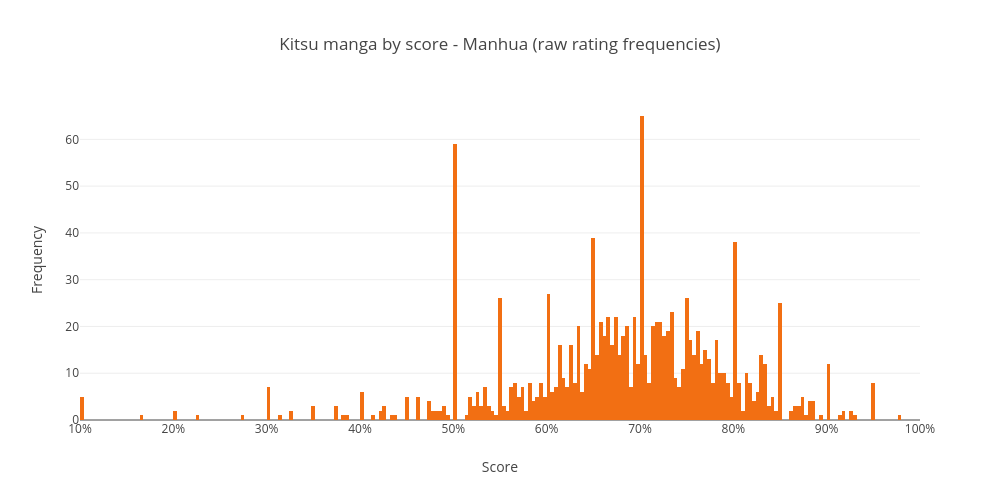
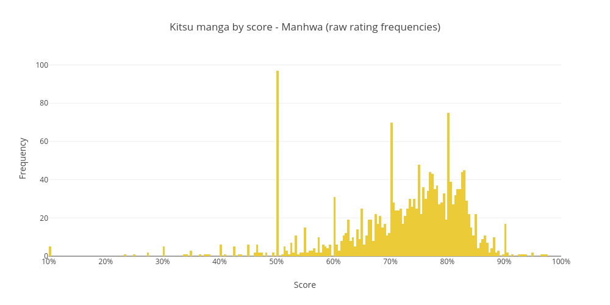
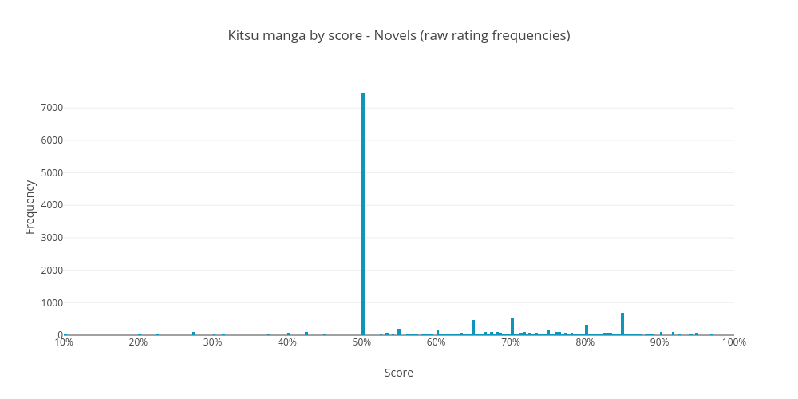
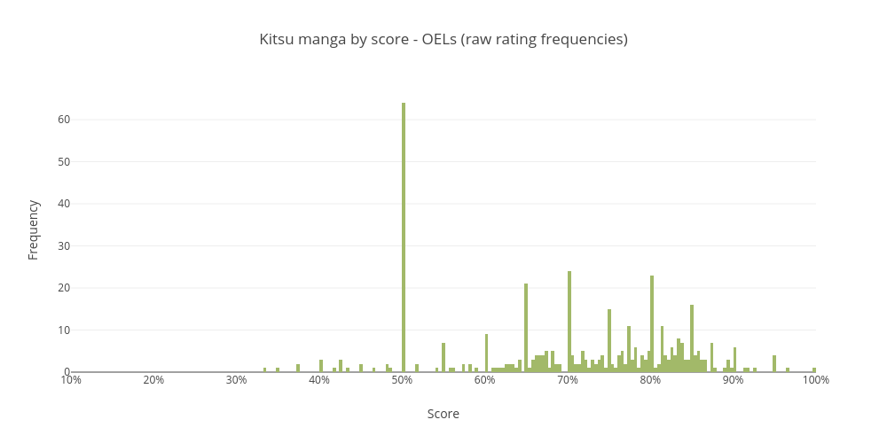
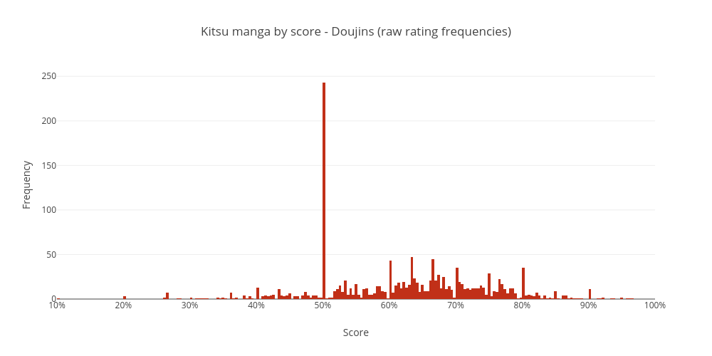
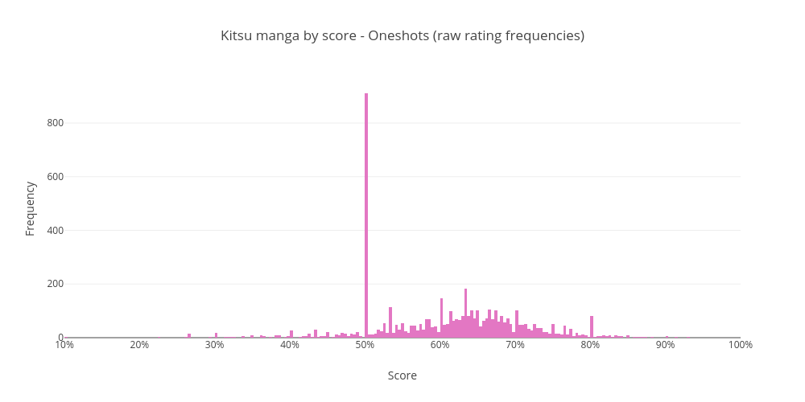