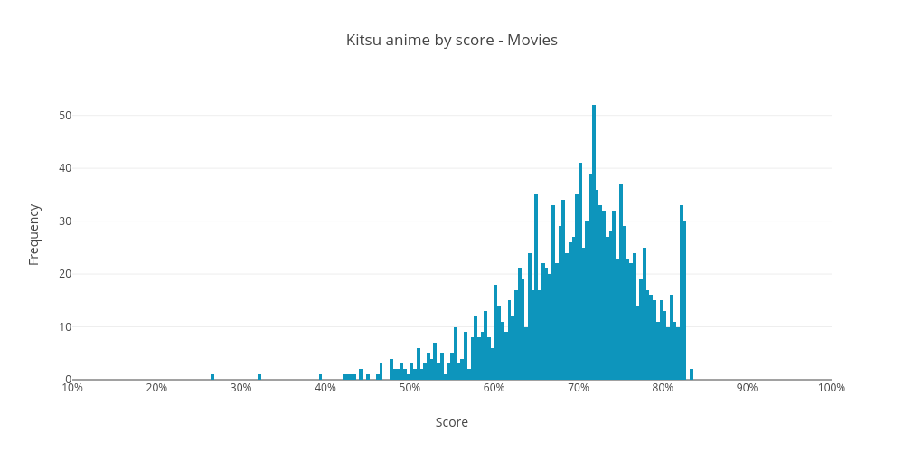
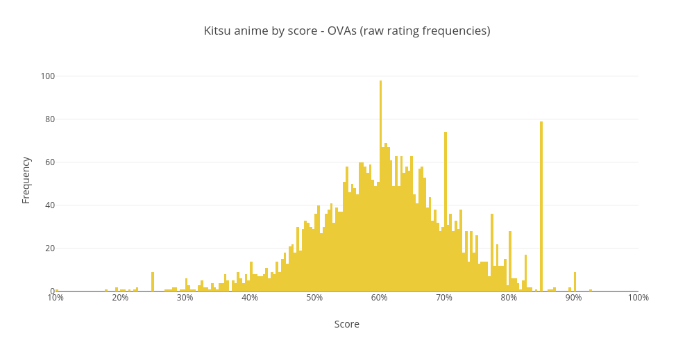
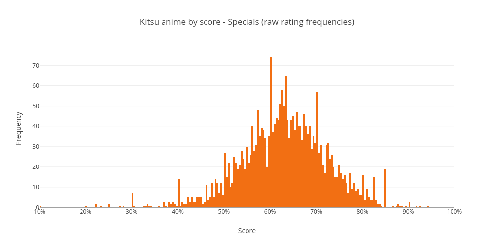

# Kitsu anime by score

Jump To:
- [Results - Average Ratings](#average-ratings)
- [Results - Rating Frequencies](#rating-frequencies)

## Run It

- `yarn install` - Install dependencies
- `node .` - Get fresh data (optional, requires an `accessToken` for NSFW anime)
- `node graph` - Generate images (requires a [Plot.ly](https://plot.ly) account)
- `node stats` - Show statistics

## Results

### Average Ratings

This uses the `averageRating` field from Kitsu's API, which is the
weighted mean (?) of the `ratingFrequencies`. There are a considerable
amount of unrated shows with this method, as this field is only
populated when more than `100` users have rated the show.

|          |      All |   TV | Movies | ONAs | OVAs | Specials | Music |
| -------: | -------: | ---: | -----: | ---: | ---: | -------: | ----: |
|    Rated | **6310** | 2452 |    888 |  245 | 1606 |      972 |   147 |
|  Unrated | **7340** | 1746 |   1648 |  694 | 1805 |      910 |   537 |
|  Average | **6.98** | 7.11 |   7.15 | 6.49 | 6.81 |     6.92 |  6.66 |
|   Median | **6.98** | 7.12 |   7.21 | 6.55 | 6.85 |     6.92 |  6.68 |
| Variance | **0.50** | 0.55 |   0.54 | 0.72 | 0.41 |     0.31 |  0.24 |
|    STDEV | **0.71** | 0.74 |   0.73 | 0.85 | 0.64 |     0.55 |  0.49 |
|      10% | **6.15** | 6.17 |   6.24 | 5.34 | 6.12 |     6.23 |  6.18 |
|      20% | **6.47** | 6.53 |   6.64 | 6.00 | 6.42 |     6.49 |  6.30 |
|      30% | **6.67** | 6.75 |   6.85 | 6.22 | 6.60 |     6.65 |  6.44 |
|      40% | **6.83** | 6.95 |   7.04 | 6.39 | 6.74 |     6.78 |  6.57 |
|      50% | **6.98** | 7.12 |   7.21 | 6.55 | 6.85 |     6.92 |  6.68 |
|      60% | **7.14** | 7.28 |   7.36 | 6.71 | 6.97 |     7.06 |  6.78 |
|      70% | **7.30** | 7.45 |   7.52 | 6.87 | 7.10 |     7.18 |  6.93 |
|      80% | **7.51** | 7.69 |   7.72 | 7.20 | 7.26 |     7.36 |  7.03 |
|      90% | **7.86** | 8.09 |   8.04 | 7.48 | 7.53 |     7.63 |  7.21 |

### Rating Frequencies

Essentially the raw rating for a show. `ratingFrequencies` is an
object that contains the number of users that have rated the show
on a `2..20` scale (`1` to `10` in `.5` increments). Converted into
a weighted mean to get an average rating.

All of these show clear spikes at `X.0` intervals (and somewhat less
prominent at `X.5` intervals), a result of many obscure shows which
only have a single user rating.

|          |       All |   TV | Movies | ONAs | OVAs | Specials | Music |
| -------: | --------: | ---: | -----: | ---: | ---: | -------: | ----: |
|    Rated | **13480** | 4114 |   2506 |  908 | 3398 |     1873 |   681 |
|  Unrated |   **170** |   84 |     30 |   31 |   13 |        9 |     3 |
|  Average |  **5.89** | 6.34 |   5.74 | 5.09 | 5.78 |     6.09 |  4.77 |
|   Median |  **6.15** | 6.63 |   6.06 | 5.25 | 5.99 |     6.27 |  4.82 |
| Variance |  **2.68** | 2.68 |   3.38 | 3.13 | 1.90 |     1.97 |  1.78 |
|    STDEV |  **1.64** | 1.64 |   1.84 | 1.77 | 1.38 |     1.40 |  1.33 |
|      10% |  **3.80** | 4.50 |   3.14 | 3.00 | 4.00 |     4.33 |  3.00 |
|      20% |  **4.75** | 5.44 |   4.17 | 3.80 | 4.89 |     5.23 |  3.67 |
|      30% |  **5.33** | 5.98 |   4.93 | 4.33 | 5.31 |     5.72 |  4.00 |
|      40% |  **5.81** | 6.32 |   5.50 | 4.91 | 5.68 |     6.00 |  4.33 |
|      50% |  **6.15** | 6.63 |   6.06 | 5.25 | 5.99 |     6.27 |  4.82 |
|      60% |  **6.50** | 6.92 |   6.50 | 5.65 | 6.25 |     6.53 |  5.15 |
|      70% |  **6.83** | 7.19 |   6.94 | 6.00 | 6.54 |     6.82 |  5.50 |
|      80% |  **7.16** | 7.49 |   7.31 | 6.50 | 6.86 |     7.09 |  5.96 |
|      90% |  **7.63** | 8.00 |   7.78 | 7.12 | 7.25 |     7.50 |  6.51 |

